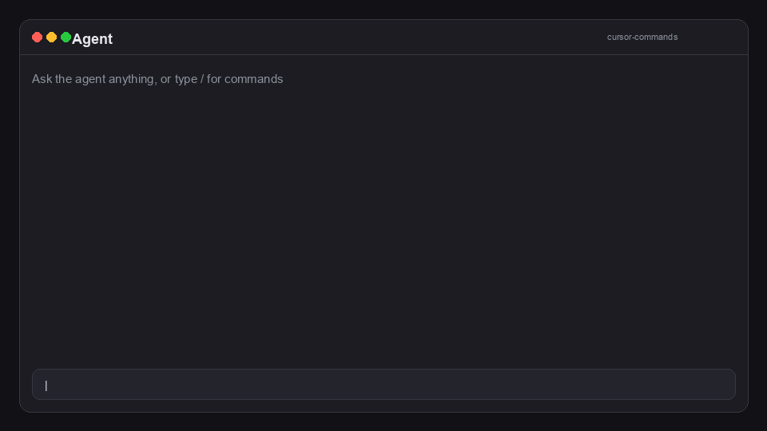
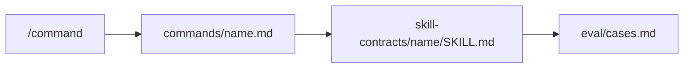

# cursor-commands

[](https://github.com/emaraschio/cursor-commands/actions/workflows/validate.yml)
[](https://github.com/emaraschio/cursor-commands/actions/workflows/install-smoke.yml)
[](https://github.com/emaraschio/cursor-commands/actions/workflows/docs.yml)
[](https://github.com/emaraschio/cursor-commands/actions/workflows/eval-fixtures.yml)

<!-- Demo GIF (uncomment after dropping docs/assets/demo.gif):

Capture (~20s): open /, show autocomplete, run /define-agent-goal, show Goal output. See docs/assets/README.md.
-->

**Production-grade Cursor slash commands:** each `/command` ships with a full agent skill contract, a behavioral eval rubric, and CI that fails if safety guards regress. Install as a [user plugin](docs/PLUGIN.md) and get the same workflows on desktop, web, CLI, and mobile.

Stable release: [`v1.6.0`](CHANGELOG.md#160---2026-08-02). Catalog: **43** commands. Not an official Cursor product.

Inspired by install ergonomics from [hamzafer/cursor-commands](https://github.com/hamzafer/cursor-commands). This repo goes further: **paired skills**, **eval rubrics**, and **structural ship-gate CI** (`run-eval-fixtures.py --strict`).

## 60-second quickstart

1. **Customize → Plugins → + Add** → `https://github.com/emaraschio/cursor-commands` (user scope). Reload if `/` is empty.
2. In agent chat, run `/define-agent-goal` with a tiny task. Expect a six-part Goal and a halt (no code edits until a later **execute now**).

Lightly trimmed example (generic names only):

```text
# Agent goal: Reduce flaky tests in service-a

## 1. Outcome
Flake rate under 1% over 10 CI runs on service-a integration specs; no deleted coverage without replacement.

## 2. Verification
### Success criteria
- [ ] Flake rate under 1% across 10 CI runs
- [ ] Existing test intent preserved
- [ ] No production deploys

## 3. Constraints
No production deploys; keep existing test intent.

## 4. Boundaries
service-a/spec/integration/, CI job integration.

## 5. Iteration policy
Max 2 passes: stabilize the top flake, then remeasure.

## 6. Stopping condition
Ask before deleting coverage or changing CI matrix.

Approve or edit this Goal before I execute. Goal approval alone is not permission to execute.
```

Full install options and duplicate-menu troubleshooting: [docs/PLUGIN.md](docs/PLUGIN.md).

## Why this catalog

Most Cursor command packs are markdown snippets. This one treats prompts like code.

| You get | Why it matters |
|---------|----------------|
| **43 slash commands** | Review, TDD, PRs, audits, planning, git sync, and more, ready in `/` |
| **Paired skill contracts** | The real workflow lives in `SKILL.md`, not a one-line prompt |
| **Ship-gate evals in CI** | Fixtures lock anti-pattern guards so regressions fail the build |
| **User plugin package** | One install follows your Cursor account (desktop, web, CLI, iOS) |
| **Host overlays** | Keep employer-specific commands in *your* workspace; this catalog stays portable |

Portable examples and no org trademarks are a **publishing constraint**, not the product pitch. The product is reliable agent workflows you can install, fork, and extend.

## Highlights

Full table: [COMMANDS_INDEX.md](.cursor/docs/COMMANDS_INDEX.md).

| Command | What it does |
|---------|----------------|
| `/code-review` | Thorough PR review before you approve |
| `/tdd` | Red-green-refactor with an explicit test-first contract |
| `/requirement-to-implementation` | Approved requirement → plan → implement → document |
| `/define-agent-goal` | Turn a rough task into a six-part Goal an agent can run with less babysitting |
| `/pathfinder` | Fog-of-war planning when the codebase is unfamiliar |
| `/automation-roi-audit` | Interview real workflows; label Human / AI-assisted / AI-owned; pick a one-week ROI test |
| `/decision-audit` | Post-build decision ledger and pride gate; no code changes until revise |
| `/instruction-ablation` | Bare-baseline rebuild of instructions; add only after repeated failures |
| `/gauntlet-loop` | Beat a real-world quality bar via builder/critic loops |
| `/merge-open-prs` | Batch review, verify, merge when green (limit 10) |
| `/thermo-nuclear-code-quality-review` | Extremely strict maintainability pass without changing behavior |

**External dependency:** `/merge-open-prs` expects the user-global **babysit** skill at `~/.cursor/skills-cursor/babysit/SKILL.md`. See [docs/DEPENDENCIES.md](docs/DEPENDENCIES.md).

## What you get

- **43** slash commands and **43** skill-contract directories (one pair per command; bodies live under `.cursor/skill-contracts/`, not `.cursor/skills/`)
- **User plugin package** (`.cursor-plugin/` + materialized `plugin/` tree) for **Customize → Plugins**
- **Behavioral evals** (`PASS` / `PARTIAL` / `FAIL`) per command, with ship-gate sections enforced in CI

## Installation

**Recommended:** install as a [user plugin](docs/PLUGIN.md) so commands sync with your Cursor account.

### Plugin (recommended)

1. Open **Customize** (or **Settings → Plugins**) and select your **user** scope.
2. **Plugins** → **+ Add** → `https://github.com/emaraschio/cursor-commands`.
3. Reload the window if `/` autocomplete does not list catalog commands yet.

Details, mobile smoke checks, and duplicate-menu troubleshooting: [docs/PLUGIN.md](docs/PLUGIN.md).

### Standalone clone (symlink install)

```bash
git clone https://github.com/emaraschio/cursor-commands.git
cd cursor-commands
chmod +x scripts/install.sh
./scripts/install.sh          # merge mode (default)
```

Symlinks land in `~/.cursor/commands/` and `~/.cursor/skill-contracts/`. Host workspaces resolve contracts from `~/.cursor/skill-contracts/<name>/SKILL.md` when the workspace copy is missing. **Merge mode** keeps your own files; use `--replace` only to wipe those directories first, or `--prune` to drop stale symlinks after a rename.

Plugin install and symlink install can coexist but **should not**: you get duplicate `/` menu entries. Prefer the **user plugin** alone, or run `./scripts/install.sh --uninstall` first. See [docs/PLUGIN.md](docs/PLUGIN.md#duplicate-entries-in-the--menu).

### As a Git submodule

```bash
cd path/to/parent-repo
git submodule update --init path/to/cursor-commands
./path/to/cursor-commands/scripts/install.sh
```

The parent repo owns workspace-specific Cursor **rules**, **agents**, and **memory-bank** files. This repo ships shared slash commands and skills only.

### Custom Cursor home

```bash
CURSOR_HOME="$HOME/.cursor" ./scripts/install.sh
```

Org-specific packs install from the **host workspace** overlay after the catalog. See [docs/ROADMAP.md](docs/ROADMAP.md).

## Architecture

| Doc | What it covers |
|-----|----------------|
| [PLUGIN.md](docs/PLUGIN.md) | User plugin install, mobile, duplicate `/` menu |
| [EVAL_CI.md](docs/EVAL_CI.md) | Ship-gate fixtures and CI enforcement |
| [VERIFICATION.md](docs/VERIFICATION.md) | Manual IDE smoke and release records |
| [ROADMAP.md](docs/ROADMAP.md) | Launch criteria and next priorities |
| [COMMAND_SCHEMA.md](.cursor/docs/COMMAND_SCHEMA.md) | Command + skill contract shape |

```text
.cursor/commands/<name>.md   # thin slash entry (YAML frontmatter)
.cursor/skill-contracts/<name>/
  SKILL.md                   # full agent contract
  eval/
    cases.md                 # behavioral rubric
    fixtures.yaml            # ship-gate anchors for CI
    README.md                # how to score
```

Plugin installs use a materialized `plugin/` tree (no `.git`) from `.cursor-plugin/marketplace.json`. After catalog edits, run `./scripts/sync-plugin-package.sh`.

Schema: [COMMAND_SCHEMA.md](.cursor/docs/COMMAND_SCHEMA.md).



## Evaluations

We treat prompts like code: editable contracts need reviewable tests.

- **Structural checks in CI**: no LLM judge on every PR (flaky and expensive). Ship-gate rows use `fixtures.yaml`.
- Each command declares **ship gate** sections in frontmatter (for example `A`, `S`; `merge-open-prs` uses `A`, `D`, `E`).
- Scoring: `PARTIAL` counts as fail; target 0 `FAIL` on ship gate before merge.

How to run: [EVAL_GUIDE.md](.cursor/docs/EVAL_GUIDE.md). Spec: [docs/EVAL_CI.md](docs/EVAL_CI.md).

```bash
python3 scripts/validate-cursor-commands.py
python3 scripts/run-eval-fixtures.py --strict
./scripts/sync-plugin-package.sh   # after editing commands/skills
```

### Anti-patterns as enforced contract

Negative knowledge is captured once, promoted into the skill, and locked in CI:

1. Command `## Anti-patterns` entry: `Trigger / Wrong / Correct / Reason`.
2. Matching positive guard in `SKILL.md`.
3. `skill_required` anchor in `eval/fixtures.yaml` so removing the guard fails `--strict`.

Entries are curated, not append-only. Optional IDE smoke after install: [docs/VERIFICATION.md](docs/VERIFICATION.md).

CI on `main` and PRs: **validate**, **docs**, **install-smoke**, **eval-fixtures**. Releases: tag `v*` → [release.yml](.github/workflows/release.yml).

## Contributing

Star the repo if this saves you time. Open issues and PRs if you want to extend it.

1. Read [CONTRIBUTING.md](CONTRIBUTING.md), [COMMAND_SCHEMA.md](.cursor/docs/COMMAND_SCHEMA.md), and [docs/EVAL_CI.md](docs/EVAL_CI.md).
2. Add or change a command as a thin `.cursor/commands/<name>.md` plus `.cursor/skill-contracts/<name>/` (skill + eval + fixtures).
3. Run `validate-cursor-commands.py` and `run-eval-fixtures.py --strict` locally before you push.
4. Walk ship-gate sections when behavior changes; note results in the PR.

Security reports: [SECURITY.md](SECURITY.md). Roadmap: [docs/ROADMAP.md](docs/ROADMAP.md).

## Related

- [Cursor slash commands docs](https://cursor.com/docs/agent/chat/commands)
- [Cursor plugins docs](https://cursor.com/docs/plugins)
- [hamzafer/cursor-commands](https://github.com/hamzafer/cursor-commands): minimal command-only collection

**Topics:** `cursor`, `cursor-ide`, `agent-skills`, `ai-agents`, `prompts`, `developer-tools`, `dotfiles`, `github-actions`, `cursor-plugins` (see GitHub **About** on [emaraschio/cursor-commands](https://github.com/emaraschio/cursor-commands)).

## License

MIT. See [LICENSE](LICENSE).
