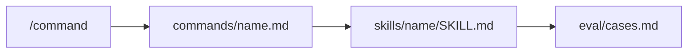

# cursor-commands

[](https://github.com/emaraschio/cursor-commands/actions/workflows/validate.yml)
[](https://github.com/emaraschio/cursor-commands/actions/workflows/install-smoke.yml)
[](https://github.com/emaraschio/cursor-commands/actions/workflows/docs.yml)
[](https://github.com/emaraschio/cursor-commands/actions/workflows/eval-fixtures.yml)

**Stable release: [`v1.4.0`](CHANGELOG.md#140---2026-06-30)**. Generic Cursor slash commands, Agent Skills, and behavioral eval rubrics. Install from `main`, `git checkout v1.4.0`, or as a [user plugin](docs/PLUGIN.md) via **Customize → Plugins**. Ship-gate sections are enforced in CI via [docs/EVAL_CI.md](docs/EVAL_CI.md). Organization-specific packs install from the **host workspace**.

Inspired by install ergonomics from [hamzafer/cursor-commands](https://github.com/hamzafer/cursor-commands); this repo adds **skills**, **eval rubrics**, and **structural ship-gate CI** (`run-eval-fixtures.py --strict`).

## What you get

- **37** generic slash commands (git, review, TDD, structure-prompt, agent work receipt, security audits, agent goals, prompt eval debug, agent risk review, scoped parallel audits, workspace git sync, PR workflows, requirement-to-implementation, thermo-nuclear code quality review, etc.)
- **37** skill directories (one per command)
- **User plugin package** (`.cursor-plugin/` manifests + materialized `plugin/` tree) for **Customize → Plugins** install and account sync (desktop, web, CLI, iOS)
- **Behavioral evals** (`PASS` / `PARTIAL` / `FAIL`) per command: regression guardrails when editing prompts

## Installation

**Recommended for account and mobile sync:** install as a [user plugin](docs/PLUGIN.md) from GitHub (`https://github.com/emaraschio/cursor-commands`) via **Customize → Plugins → + Add**. Slash commands and skills then follow your Cursor account to desktop, web, CLI, and the [iOS app](https://cursor.com/docs/cloud-agent/mobile).

### Plugin (recommended)

1. Open **Customize** in the Cursor sidebar (or **Settings → Plugins**).
2. Select your **user** scope.
3. **Plugins** tab → **+ Add** → repository URL `https://github.com/emaraschio/cursor-commands`.
4. Reload the window if `/` autocomplete does not list catalog commands yet.

Details, mobile smoke checks, folder-picker troubleshooting, and local dev symlink: [docs/PLUGIN.md](docs/PLUGIN.md).

### Standalone clone (symlink install)

```bash
git clone https://github.com/emaraschio/cursor-commands.git
cd cursor-commands
chmod +x scripts/install.sh
./scripts/install.sh          # merge mode (default)
```

Commands and skills from this catalog are symlinked into `~/.cursor/commands/` and `~/.cursor/skills/`. Use this path for submodule/dotfiles workflows or host overlays after the generic catalog. **Merge mode (default)** keeps your own files and org-specific commands installed afterward. Use `./scripts/install.sh --replace` only if you want to wipe those directories first. Use `--prune` to remove stale symlinks that still point into this repo after a catalog rename.

Plugin install and symlink install can coexist; avoid duplicate command names outside this catalog.

### As a Git submodule

If a parent repo (for example personal dotfiles) vendors this tree:

```bash
cd path/to/parent-repo
git submodule update --init path/to/cursor-commands
./path/to/cursor-commands/scripts/install.sh
```

The parent repo owns workspace-specific Cursor **rules**, **agents**, and **memory-bank** files. This repo only ships shared slash commands and skills.

### Custom Cursor home

```bash
CURSOR_HOME="$HOME/.cursor" ./scripts/install.sh

# Host overlay: install generic, then org-specific symlinks from your dotfiles (merge-safe).
```

## Architecture

Catalog source of truth:

```text
.cursor/commands/<name>.md   # thin slash entry (YAML frontmatter)
.cursor/skills/<name>/
  SKILL.md                   # full agent contract
  eval/
    cases.md                 # behavioral rubric
    README.md                # ship gate + how to score
```

Plugin install copies a materialized `plugin/` tree (no `.git`) referenced by `.cursor-plugin/marketplace.json`. After catalog edits, run `./scripts/sync-plugin-package.sh`.

Details: [COMMAND_SCHEMA.md](.cursor/docs/COMMAND_SCHEMA.md)



## Catalog

Full table: [COMMANDS_INDEX.md](.cursor/docs/COMMANDS_INDEX.md)

| Highlight | Description |
|-----------|-------------|
| `/merge-open-prs` | Batch review, Docker verify, merge when green (limit 10) |
| `/code-review` | Thorough PR review before approval |

**External dependency:** `/merge-open-prs` expects the user-global **babysit** skill at `~/.cursor/skills-cursor/babysit/SKILL.md`.

**Org-specific commands** (domain scripts, onboarding, custom security review, rules benchmarks) are **not** in this repo; install them from your host workspace overlay. See [docs/ROADMAP.md](docs/ROADMAP.md).

## Evaluations

We treat prompts like code: editable contracts need reviewable tests.

- **Structural checks in CI**: no LLM judge on every PR (flaky, expensive); ship-gate rows use `fixtures.yaml`.
- Each command defines **ship gate** sections in frontmatter (e.g. `A`, `S`; merge-open-prs uses `A`, `D`, `E`).
- Scoring: `PARTIAL` counts as fail; target 0 `FAIL` on ship gate before merge.

How to run: [EVAL_GUIDE.md](.cursor/docs/EVAL_GUIDE.md)

Example flow:

1. Read only `skills/<name>/SKILL.md`.
2. For each case in `eval/cases.md`, draft the agent response.
3. Mark `PASS` / `PARTIAL` / `FAIL`.
4. Fix skill/command before push if any ship-gate case fails.

### Anti-patterns as enforced contract

Negative knowledge (what not to do) is treated like any other contract: captured in a fixed shape, promoted into the skill, and enforced so a corrected mistake cannot regress. There is no separate ever-growing pitfalls file.

- Anti-pattern entries use a `Trigger / Wrong / Correct / Reason` shape, so each one names the situation, the failure, the fix, and why it matters.
- The fix is promoted into `SKILL.md` as a positive guard and anchored with `skill_required` in `eval/fixtures.yaml`. `run-eval-fixtures.py --strict` then fails in CI if that guard is ever removed.
- Entries are curated, not append-only: when the root cause is gone, the entry goes with it.

After install, optional IDE check: [docs/VERIFICATION.md](docs/VERIFICATION.md)

## Validation

```bash
python3 scripts/validate-cursor-commands.py   # includes plugin manifest + plugin/ sync check
python3 scripts/run-eval-fixtures.py --strict
./scripts/sync-plugin-package.sh              # after editing commands/skills (contributors)
```

CI on `main` and PRs: **validate**, **docs**, **install-smoke**, **eval-fixtures** (see branch protection). New releases: push tag `v*` to run [release.yml](.github/workflows/release.yml).

## Contributing

See [CONTRIBUTING.md](CONTRIBUTING.md). Security reports: [SECURITY.md](SECURITY.md).

## Related

- [Cursor slash commands docs](https://cursor.com/docs/agent/chat/commands)
- [Cursor plugins docs](https://cursor.com/docs/plugins)
- [hamzafer/cursor-commands](https://github.com/hamzafer/cursor-commands): minimal command-only collection

**Topics:** `cursor`, `cursor-ide`, `agent-skills`, `ai-agents`, `prompts`, `developer-tools`, `dotfiles`, `github-actions`, `cursor-plugins` (see GitHub **About** on [emaraschio/cursor-commands](https://github.com/emaraschio/cursor-commands)).

## License

MIT. See [LICENSE](LICENSE).
